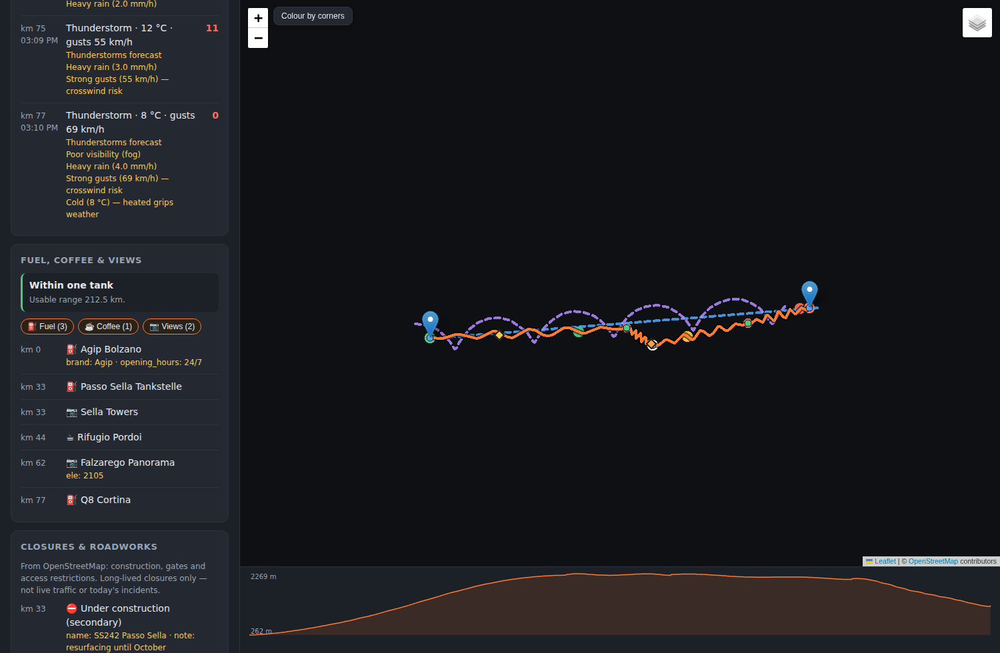
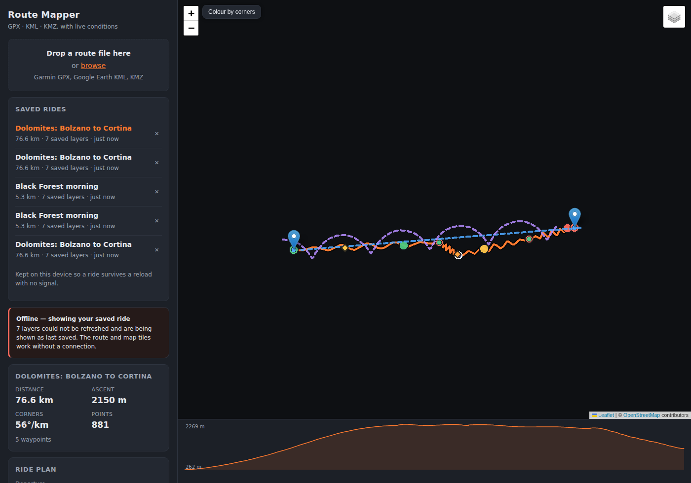
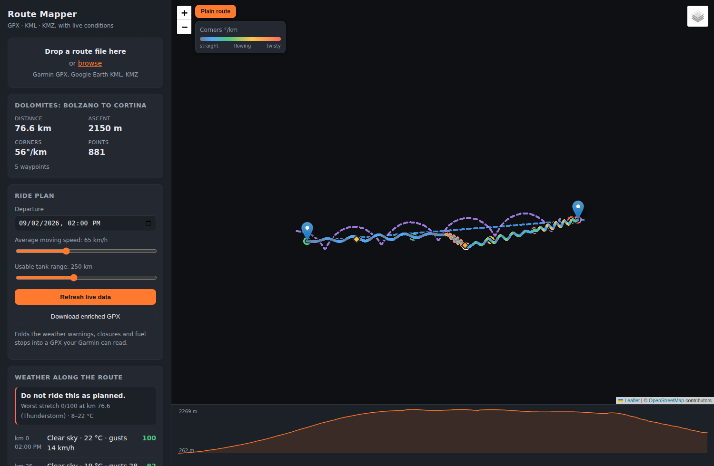

# Motorcycle Route Mapper

Load a GPX, KML or KMZ route, draw it on a map with its waypoints, and layer
live conditions on top: weather timed to where you will actually be, mapped
road closures, and alternate ways round.

It runs on your own machine. No account, no subscription, no API key.



The same ride with the network switched off — route, profile and every layer
restored from the browser, with a banner saying so:



Colour the same route by how twisty it is:



---

## Quick start

```bash
git clone https://github.com/gmarkop/motorcycle-route-mapper.git
cd motorcycle-route-mapper
pip install -r requirements.txt
python run.py
```

Your browser opens at <http://127.0.0.1:8000>. Drag `examples/dolomites_demo.gpx`
onto the drop zone to see everything working.

```bash
python run.py --offline      # map and route only, no network calls
python run.py --host 0.0.0.0 # reachable from your phone on the same wifi
python -m pytest             # run the test suite
```

Python 3.11 or newer.

---

## What it does

**Reads the files your planner actually produces.** Garmin BaseCamp hides the
calculated road geometry inside `<rtept><extensions><gpxx:rpt>` elements — miss
those and a Garmin route draws as straight lines between your stops. It also
distinguishes a *via point* (a place you chose to stop) from a *shaping point*
(a point that only exists to drag the line onto a nicer road), so the map is not
buried in markers you never cared about. Google Earth KML, KMZ archives, `gx:Track`
and multi-geometry placemarks are all handled.

**Times the weather to your ride.** The route is sampled every ~25 km, each
sample gets an arrival time from your departure and average speed, and the
forecast is read *at that hour*. Knowing it will rain in Cortina is useless;
knowing it will rain in Cortina at 14:00, when you get there, is the point.

**Scores conditions for two wheels, not four.** Each sample gets a *rideability*
score from 0 to 100 with the reasons spelled out. The weighting is deliberately
motorcycle-shaped: ice outranks everything, then thunderstorms and gusts, then
cold, then rain. A car's navigation app weights none of this the same way.

**Finds mapped closures.** Construction, gates, access restrictions and seasonal
roads within 150 m of your line, from OpenStreetMap via Overpass, each reported
at its position along the route ("closed gate at km 62").

**Compares alternates by corner count.** Alternate routes are measured for
*curviness* in degrees of heading change per kilometre, alongside distance and
time. "12 minutes longer, three times the corners" is usually the right trade on
a bike, and no car router will ever offer it to you.

**Plans fuel around a motorcycle tank, not a car's.** Fuel stations near the
route are sorted by position along it and run through a greedy plan: ride to the
last pump still in range, fill up, repeat. A bike carries 15-20 litres, not 60,
so "next fuel in 140 km" is a real problem — and in the Alps or rural Spain the
gap between stations genuinely exceeds a tank. Any stretch you cannot cross is
reported **before you leave**, not when the fuel light comes on. Coffee stops and
viewpoints come along for the ride, each with its own corridor width: fuel is
worth a detour, a cafe is only worth it if it is already on the way.

**Colours the route by how twisty it is.** A single curviness number for a whole
ride is the wrong tool — 100 km of motorway and 20 km of hairpins average out to
"mildly interesting" and hide both halves. The heat map walks a sliding window
along the route instead, so you can see at a glance which third of the day is
the good bit.

**Reads live incidents, if you have a feed.** OpenStreetMap knows about a pass
gated shut for winter; it does not know about this morning's crash. That needs a
road authority, so there is a small provider interface with two implementations:
a generic GeoJSON adapter for any feed you point it at, and Germany's keyless
Autobahn API, which works out which motorways your route uses from OSM and needs
no configuration at all.

**Keeps working when the signal does not.** One button caches the map tiles
along your route, and the ride itself — the parsed route, the last good answer
from every live layer, and the original file — is kept in the browser. Reload
the tab in an Alpine valley and your route is still there, with a banner saying
plainly which parts are live and which are from the last time you had signal.
Because the file itself is kept, a server restart is invisible too: the app
re-uploads it and carries on rather than asking you to find the GPX again on a
phone in the rain.

**Writes the whole lot back out as GPX.** The findings are no use stuck on the
laptop while you ride off with the original file. The export folds the weather
warnings, closures and planned fuel stops back in as ordinary waypoints with
Garmin symbol names, so the device shows them as proper icons and no device
needs to understand anything specific to this app.

Plus an elevation profile you can hover to see where you are on the map, and a
[Douglas-Peucker](https://en.wikipedia.org/wiki/Ramer%E2%80%93Douglas%E2%80%93Peucker_algorithm)
simplification pass so a 20 000-point track sends about 250 points to the browser.

---

## Honest limits

Worth knowing before you rely on any of it:

- **Closures are not live traffic.** OpenStreetMap knows about a pass gated shut
  for winter or a bridge under construction. It does not know about this
  morning's crash on the A8. There is no free pan-European live incident API;
  each national road authority runs its own feed, mostly without an open licence.
- **The ETA model is a constant average speed.** No traffic, no stops, no border
  queues. An hour-resolution forecast cannot tell the difference anyway, but
  a long day will drift — nudge the speed slider to see how much it matters.
- **The public OSRM demo server is rate-limited** and explicitly not for
  production use. If you lean on alternates, self-host OSRM and point
  `MOTO_OSRM_URL` at it.
- **Open-Meteo is free for non-commercial use.** Responses are cached for 15
  minutes on disk so normal planning stays well inside fair use.
- **Offline tiles are deliberately limited.** OpenStreetMap's tile usage policy
  forbids bulk downloading and names 250 tiles as the limit for an area, so that
  is the default cap and requests are spaced out rather than fired in a burst.
  Tiles are chosen along the route corridor rather than over its bounding box,
  which is what makes 250 enough to be useful. Raise `MOTO_MAX_CACHED_TILES`
  only when pointing at a tile server you run yourself.
- **Offline caching needs a secure context.** Service workers only register over
  https or on localhost, so tile caching works when you run this on your own
  machine but not when you reach it from a tablet over plain `http://192.168.x.x`.
  The saved ride itself uses IndexedDB, which has no such restriction and works
  either way.
- **Offline means "the ride you already loaded".** You cannot open a *new* file
  without reaching the server — parsing happens there. Load the route while you
  have signal and it stays available; the live layers then keep showing their
  last good answer, clearly marked, until you are back in range.
- **Browser storage is not permanent.** Safari evicts script-writable storage
  after roughly a week without visiting a site. Adding the app to the iPad home
  screen exempts it, which matters if you cache a ride on Sunday and set off on
  Friday.
- **The Autobahn provider is unverified.** The live endpoints were unreachable
  from the environment this was built in, so the response mapping follows the
  documented shape and is covered by tests against recorded fixtures — but it has
  never seen the real service. It fails soft: a wrong guess about the schema
  shows an empty layer, not a broken app. Confirm it returns real data before
  trusting it.
- **Incident coverage is only what you configure.** An empty incidents layer
  means no feed covers that road, not that the road is clear.
- **Leaflet is vendored locally**, so the interface and your route work with no
  internet at all — only uncached tiles go blank.
- **No authentication.** `run.py` binds to localhost for that reason. Think
  before using `--host 0.0.0.0`.

---

## How it is put together

```
moto_route/
├── geo.py             Distances, bearings, simplification, sampling, curviness
├── models.py          GeoPoint / Waypoint / Route — the one shape everything speaks
├── config.py          Settings from environment variables
├── export.py          Writes the enriched ride back out as GPX
├── api.py             FastAPI endpoints and the in-memory route store
├── parsers/
│   ├── common.py      Namespace-agnostic XML helpers, and the XML-bomb guard
│   ├── gpx.py         GPX 1.0/1.1, tracks, routes, Garmin extensions
│   ├── kml.py         KML, KMZ, gx:Track, MultiGeometry
│   └── __init__.py    Format sniffing and dispatch
├── services/
│   ├── cache.py       TTL cache, memory then disk
│   ├── weather.py     Open-Meteo + the rideability score
│   ├── hazards.py     Overpass closures within a corridor of the route
│   ├── pois.py        Fuel, coffee, viewpoints + tank-range planning
│   ├── incidents.py   Road-authority feeds behind a provider interface
│   └── alternates.py  OSRM alternates, ranked by corners
└── static/
    ├── sw.js          Service worker: app shell + offline map tiles
    └── js/
        ├── app.js     Entry point, orchestration, elevation profile
        ├── mapview.js Everything that draws on the map
        ├── panels.js  Sidebar rendering
        ├── tiles.js   Slippy-map maths and tile prefetching
        ├── store.js   IndexedDB: the saved ride, its layers and its file
        └── format.js  Pure formatting helpers
```

The frontend uses native ES modules — no bundler, no build step, no framework.
Open any file and what you see is what the browser runs.

The shape of the thing: **parse once, enrich independently.** A file is parsed
into a `Route` and kept in memory under an id. The browser then asks for weather,
closures and alternates as three separate requests that load in parallel. A slow
Overpass query never delays the map, and any one service failing degrades to a
message in the sidebar rather than an empty screen.

### Ideas worth stealing from the code

If you are reading this to pick up Python patterns, these are the parts that
earn their keep:

**Match on the local name, not the namespace** (`parsers/common.py`). GPX 1.0,
GPX 1.1 and KML 2.2 all use different namespace URLs, and ElementTree reports
tags as `{namespace}localname`. Matching on the local name alone lets one parser
read every dialect instead of hard-coding URLs that a new exporter will break.

**Refuse a DTD before parsing** (`parsers/common.py`). `xml.etree` will happily
expand nested entity declarations until the process runs out of memory — the
"billion laughs" attack. A route file never needs a DTD, so rejecting one
outright costs nothing and closes the hole. Any code that parses XML from
outside your own program needs this.

**Bound your worst case, not just your average** (`geo.py`). Douglas-Peucker is
fast on a normal track and quadratic on a noisy one; a 20 000-point adversarial
file took minutes before a cheap radial pre-filter and an explicit evaluation
budget brought it to under two seconds. The budget degrades the *quality* of the
result rather than failing — usually the right shape for a limit.

**An explicit stack instead of recursion** (`geo.py`). The textbook
Douglas-Peucker is recursive and blows Python's recursion limit on a long track.
The iterative version is barely longer and simply cannot.

**Batch requests to somebody else's free service** (`services/weather.py`).
Open-Meteo accepts many coordinates in one call, which turns a 20-sample
forecast into one HTTP request instead of twenty. Cache keys round coordinates
to ~1 km and times to the hour, so two nearly-identical plans share an entry.

**Cache to disk, and keep the stale copy** (`services/cache.py`). When a live
request fails, an hour-old forecast beats no forecast — as long as the UI says
it is stale. Entries are written to a temp file and renamed, so a crash
mid-write cannot leave half a JSON document that later parses as valid.

**`0` is falsy and that will bite you** (`services/weather.py`). WMO weather
code 0 means "clear sky" — the best weather there is. Written as
`CODES.get(code or -1)`, it silently becomes "Unknown". There is a regression
test named after this exact mistake.

**Read-modify-write needs one transaction** (`static/js/store.js`). Five live
layers save concurrently. Doing the read and the write as two separate
IndexedDB transactions loses updates — each reads before the others write, the
last writer wins, and most layers silently vanish. Issuing the `put` from inside
the `get` callback keeps it in one transaction, which IndexedDB serialises. The
symptom was three of seven layers persisting, and no unit test could have seen it.

**Test judgement calls against fixed input** (`tests/test_weather.py`). The
rideability score is an opinion, so the tests assert *relationships* that must
hold — freezing rain must always score worse than a merely wet day — rather than
exact numbers that would break the moment you retune a weight. The HTTP layer is
an `httpx.MockTransport`, so the suite runs offline in under ten seconds.

---

## HTTP API

Useful if you want to script it or build your own frontend.

| Method | Path | Purpose |
| --- | --- | --- |
| `GET` | `/api/health` | Version, offline flag, supported formats |
| `POST` | `/api/routes` | Upload a file (multipart `file`); returns `{id, route}` |
| `GET` | `/api/routes/{id}/weather` | `?departure=<ISO8601>&speed_kmh=<n>` |
| `GET` | `/api/routes/{id}/hazards` | Closures within the corridor |
| `GET` | `/api/routes/{id}/alternates` | Alternate routes, ranked |
| `GET` | `/api/routes/{id}/pois` | `?tank_range_km=<n>` — fuel, cafes, viewpoints + the fuel plan |
| `GET` | `/api/routes/{id}/incidents` | Live road-authority incidents |
| `GET` | `/api/routes/{id}/curviness` | `?window_m=<n>` — curviness sampled along the route |
| `GET` | `/api/routes/{id}/elevation` | Distance/elevation pairs for the profile |
| `GET` | `/api/routes/{id}/export.gpx` | The enriched ride as a downloadable GPX |

Interactive documentation is generated at <http://127.0.0.1:8000/docs>.

Every enrichment endpoint answers with `{"available": bool, "reason": str, ...}`
rather than an error status when a service is down, so a failing layer is a
sentence in the sidebar instead of a broken page.

---

## Configuration

All optional, all environment variables.

| Variable | Default | What it does |
| --- | --- | --- |
| `MOTO_OFFLINE` | `false` | Skip every network call |
| `MOTO_WEATHER_URL` | Open-Meteo | Forecast endpoint |
| `MOTO_OVERPASS_URL` | overpass-api.de | Overpass endpoint |
| `MOTO_OSRM_URL` | router.project-osrm.org | Routing server — point at your own |
| `MOTO_CACHE_DIR` | `~/.cache/moto-route` | Disk cache location |
| `MOTO_SPEED_KMH` | `65` | Default average moving speed |
| `MOTO_WEATHER_INTERVAL_M` | `25000` | Distance between weather samples |
| `MOTO_MAX_WEATHER_SAMPLES` | `24` | Cap on forecast points per route |
| `MOTO_HAZARD_CORRIDOR_M` | `150` | How far off-route a closure still counts |
| `MOTO_SIMPLIFY_M` | `15` | Drawing simplification tolerance |
| `MOTO_TIMEOUT` | `20` | HTTP timeout, seconds |
| `MOTO_TANK_RANGE_KM` | `250` | Usable tank range for fuel planning |
| `MOTO_FUEL_RESERVE` | `0.15` | Fraction of the tank held back as reserve |
| `MOTO_FUEL_CORRIDOR_M` | `1000` | How far off-route a fuel station still counts |
| `MOTO_CAFE_CORRIDOR_M` | `300` | Same, for cafes |
| `MOTO_VIEWPOINT_CORRIDOR_M` | `500` | Same, for viewpoints |
| `MOTO_MAX_CACHED_TILES` | `250` | Offline tile cap — the OSM policy limit |
| `MOTO_TILE_DELAY_MS` | `120` | Pause between prefetch requests |
| `MOTO_INCIDENT_FEEDS` | — | Comma-separated GeoJSON incident feed URLs |
| `MOTO_AUTOBAHN` | `true` | Enable the German Autobahn provider |
| `MOTO_AUTOBAHN_ROADS` | — | Pin the motorways (e.g. `A8,A81`); empty auto-detects |
| `MOTO_INCIDENT_CORRIDOR_M` | `500` | How far off-route an incident still counts |

Weather and hazard TTLs (`MOTO_WEATHER_TTL`, `MOTO_HAZARD_TTL`,
`MOTO_ROUTING_TTL`) and upload limits (`MOTO_MAX_UPLOAD`) are configurable too;
see `config.py`.

---

## Where to take it next

The first five ideas that were listed here are now built. What is left:

1. **`DEPLOY.md` and a systemd unit**, so it survives a reboot on a home server.
   Bind to loopback and put Tailscale in front: that gives a real certificate
   (so the tile cache works) and keeps an app with no authentication off the
   public internet.
2. **A LICENSE file** — without one, "public repo" legally means look, don't
   touch. MIT or Apache-2.0 if you want others to use it.
3. **More incident providers** — several European countries publish open feeds.
   Each is one small class implementing `IncidentProvider`; the generic GeoJSON
   adapter may already handle yours with nothing but a URL.
4. **Verify the Autobahn provider** against the live API and adjust the mapping
   if the real payloads differ from the documented shape.
5. **Multi-day tours** — split a long route into days with overnight stops, and
   forecast each day from its own departure time rather than one continuous ride.
6. **Ferry and toll awareness** — OSM tags both; a ferry timetable you miss by
   ten minutes costs more than any weather.
7. **Rider-tuned scoring** — the rideability weights in `services/weather.py` are
   one opinion. Someone on a faired tourer with heated grips should weight cold
   and rain far lower than someone on a naked bike.

---

## A note on the tests

173 of them, and they run offline in about ten seconds. Two patterns are worth
copying:

**HTTP is mocked at the transport, not the function.** Every service test uses
`httpx.MockTransport`, so the real request-building, status handling and JSON
parsing all execute — only the socket is fake. Patching the service function
itself would test nothing but the mock.

**Some things only a browser can test.** IndexedDB, service workers and the real
offline state do not exist under pytest, so `tools/browser_test.py` drives the
running app in headless Chromium — including switching the network genuinely
off. Every bug it has caught was invisible to the Python suite.

**Judgement calls are tested as relationships.** The rideability score and the
fuel planner are opinions, so the tests assert what must stay true — freezing
rain always scores worse than a merely wet day; the planner always picks the
furthest reachable pump — rather than exact numbers that would break the moment
you retune a weight.

## Licence and attribution

The application code is yours to do as you like with. It stands on:

- [Leaflet](https://leafletjs.com) 1.9.4 (BSD-2-Clause) — vendored in
  `moto_route/static/vendor/leaflet/`, licence included
- [OpenStreetMap](https://www.openstreetmap.org/copyright) map data (ODbL)
- [OpenTopoMap](https://opentopomap.org) tiles (CC-BY-SA)
- [Open-Meteo](https://open-meteo.com) forecasts (CC-BY 4.0, free non-commercial)
- [OSRM](http://project-osrm.org) routing (BSD-2-Clause)

Respect their usage policies — they are the reason this has no subscription.
